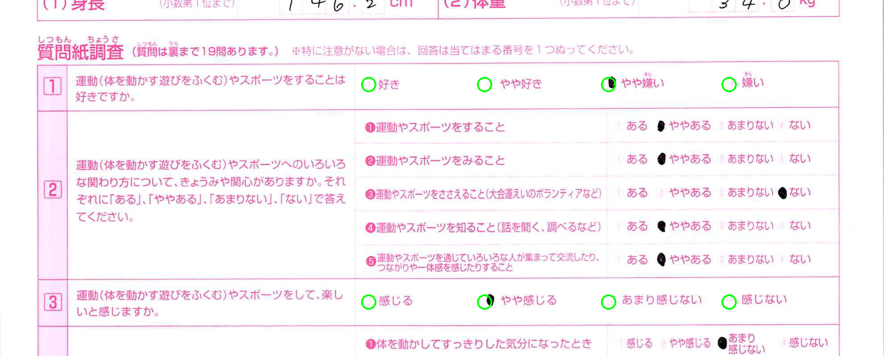

# Fitness Survey OCR - based on requirements for JP client

This repository contains Jupyter Notebooks that read scanned fitness-survey PDF forms and extract the data into Excel files using Google's Gemini AI. The pipelines integrate robust Machine Learning (ML) and Deep Learning (DL) techniques to preprocess the raw data before feeding it into the core extraction models, ensuring high accuracy and reliability. This guide covers two ways to run the pipelines: **on your own computer (local)** or **in Google Colab**.

You do not need to know how to code to follow these steps — just copy and paste the commands where shown.

---

## 1. Project Overview & Structure

The project currently supports two types of survey forms, along with an advanced processing option:
- **Comprehensive (Blue) Forms**: Processed using `ocr_pipeline_comprehensive_gemini_model_blue.ipynb`.
- **Elementary (Red) Forms**: Processed using `ocr_pipeline_elementary_gemini_model_red.ipynb`.
- **Advanced Hybrid (OpenCV + Gemini) Pipelines**: Located in the `advanced_hybrid_infras_with_openCV/` folder. This approach uses OpenCV for more precise bubble-mark detection alongside Gemini for text extraction, providing higher accuracy for checkboxes. It includes notebooks for both blue and red forms.

### Folder Structure
```text
orc-dym-pipeline-optimizer/
├── ocr_pipeline_comprehensive_gemini_model_blue.ipynb
├── ocr_pipeline_elementary_gemini_model_red.ipynb
├── input_pdfs/          # Put PDF files for the blue (comprehensive) model here
├── input_red_pdfs/      # Put PDF files for the red (elementary) model here
├── ocr_output/          # Excel outputs for the blue model are saved here
├── ocr_red_output/      # Excel outputs for the red model are saved here
└── advanced_hybrid_infras_with_openCV/  # Advanced OpenCV-based pipelines and templates
    ├── ocr_pipeline_gemini_with_opencv_blue.ipynb
    ├── ocr_pipeline_gemini_with_opencv_red.ipynb
    ├── bubble_templates_blue.json
    └── bubble_templates_red.json
```

---

## 2. Get a Gemini API Key (Required)

Regardless of how you run the code, you need a Gemini API Key:
1. Go to [Google AI Studio](https://aistudio.google.com/apikey).
2. Sign in with a Google account and click **Create API key**.
3. Copy the key (it looks like `AIzaSy...`). Keep it private — do not share it or paste it into any public file.

---

## 3. Option A — Run Locally (On your own computer)

### Step 1: Install Python
If you don't have Python installed, download it from [python.org](https://www.python.org/downloads/) (version 3.10 or newer) and install it.

### Step 2: Prepare the files
Ensure your PDFs are placed in the correct input folder depending on the form type:
- Blue forms go into `input_pdfs/`
- Red forms go into `input_red_pdfs/`

### Step 3: Install Required Packages
Open a terminal (Command Prompt on Windows, Terminal on Mac) in the project folder and run:
```bash
python3 -m venv venv
source venv/bin/activate          # on Windows use: venv\Scripts\activate
pip install pymupdf pillow openpyxl pandas google-generativeai jupyter opencv-python numpy
```

### Step 4: Set your API key
In the same terminal, set your environment variable:
```bash
export GEMINI_API_KEY="your_key_here"          
# on Windows PowerShell use: $env:GEMINI_API_KEY="your_key_here"
```
*Note: This only lasts for the current terminal session — you'll need to repeat it each time you open a new terminal.*

### Step 5: Open and Run the Notebook
Launch Jupyter Notebook:
```bash
jupyter notebook
```
This opens the notebook interface in your browser. Open either `ocr_pipeline_comprehensive_gemini_model_blue.ipynb` or `ocr_pipeline_elementary_gemini_model_red.ipynb`. Run each cell from top to bottom (click a cell, then press `Shift + Enter`).

### Step 6: Get Your Results
Once finished, the generated Excel files will be saved in their respective output directories (`ocr_output/` or `ocr_red_output/`).

---

## 4. Option B — Run on Google Colab

Colab runs the notebook in the cloud, so you don't need to install anything locally. It can also read PDFs directly from your Google Drive.

### Step 1: Upload the notebook to Colab
1. Go to [Google Colab](https://colab.research.google.com/).
2. Click **File → Upload notebook** and select either the blue or red notebook file from your computer.

### Step 2: Connect your Google Drive
At the very top of the notebook, add a new cell with:
```python
from google.colab import drive
drive.mount('/content/drive')
```
Run it and follow the on-screen link to authorize access. Your Drive will then be available under `/content/drive/MyDrive/`.

### Step 3: Point the notebook to your Drive folder
In the **config cell** (the one that sets `PDF_INPUT_DIR` and `OUT_DIR`), change the paths to a folder inside your Drive. For example, for the blue model:
```python
PDF_INPUT_DIR = "/content/drive/MyDrive/ocr_project/input_pdfs"
OUT_DIR = "/content/drive/MyDrive/ocr_project/ocr_output"
```
Create the `input_pdfs` (or `input_red_pdfs`) folder in your Google Drive beforehand and upload your PDF files into it.

### Step 4: Set your API key
Instead of the terminal command, add this near the top of the config cell:
```python
GEMINI_API_KEY = "your_key_here"
```
*(Alternatively, use Colab's built-in **Secrets** manager: click the key icon in the left sidebar, add a secret named `GEMINI_API_KEY`, then use `from google.colab import userdata; GEMINI_API_KEY = userdata.get('GEMINI_API_KEY')`.)*

### Step 5: Run all cells
Click **Runtime → Run all**. Results will be saved as an Excel file directly into your `OUT_DIR` folder in Google Drive.

---

## 5. Troubleshooting

| Problem | Likely cause |
|---|---|
| `GEMINI_API_KEY not set` warning | You forgot Step 4 (local) or Step 4 (Colab) |
| No PDFs found | Check that files are actually inside the correct `input_pdfs` or `input_red_pdfs` folder and end in `.pdf` |
| Extracted values look shifted/wrong | Check the ROI crop boundaries (`ROI_FRACTIONS` in the notebook) still match your scanned form's layout |
| Script very slow | Each page requires multiple separate AI calls; large batches take time — this is expected. |

For anything else, contact whoever provided you this project.
